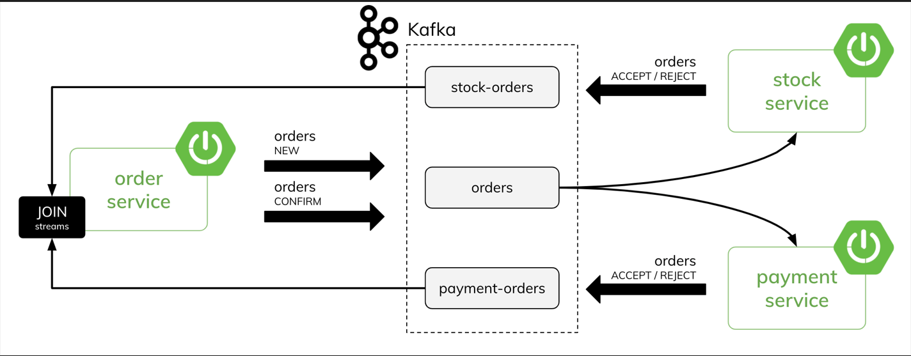

# Microservices with Spring Boot, Kafka, Saga Transaction Demo

This project demonstrates a **Saga-based distributed transaction** using an event-driven microservices architecture.

It uses:

- Spring Boot
- Apache Kafka
- Kafka Streams
- Docker
- Saga Pattern (Orchestration)

The goal of this demo is to show how **distributed transactions across microservices** can be implemented using **Kafka events and stream processing**.

---

## Description

The system consists of **three microservices**.

### order-service
- Creates new orders
- Publishes `Order` events to Kafka
- Acts as the **Saga orchestrator**
- Uses Kafka Streams to join responses from other services and determine the final order status

### payment-service
- Performs a local transaction on the **customer account**
- Verifies if the customer has enough balance
- Sends response events (`ACCEPT` or `REJECT`)

### stock-service
- Performs a local transaction on **product inventory**
- Verifies if sufficient stock is available
- Sends response events (`ACCEPT` or `REJECT`)

## Architecture and Event Flow:
(1) `order-service` send a new `Order` -> `status == NEW`  \
(2) `payment-service` and `stock-service` receive `Order` and handle it by performing a local transaction on the data  \
(3) `payment-service` and `stock-service` send a response `Order` -> `status == ACCEPT` or `status == REJECT`  \
(4) `order-service` process incoming stream of orders from `payment-service` and `stock-service`, join them by `Order` id and sends Order with a new status -> `status == CONFIRMATION` or `status == ROLLBACK` or `status == REJECTED`  \
(5) `payment-service` and `stock-service` receive `Order` with a final status and "commit" or "rollback" a local transaction make before  \

